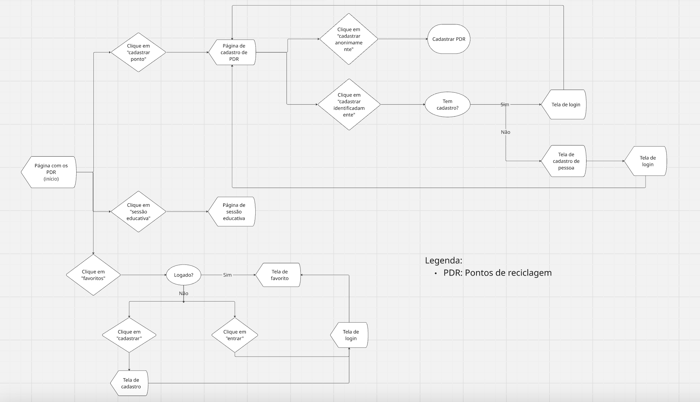
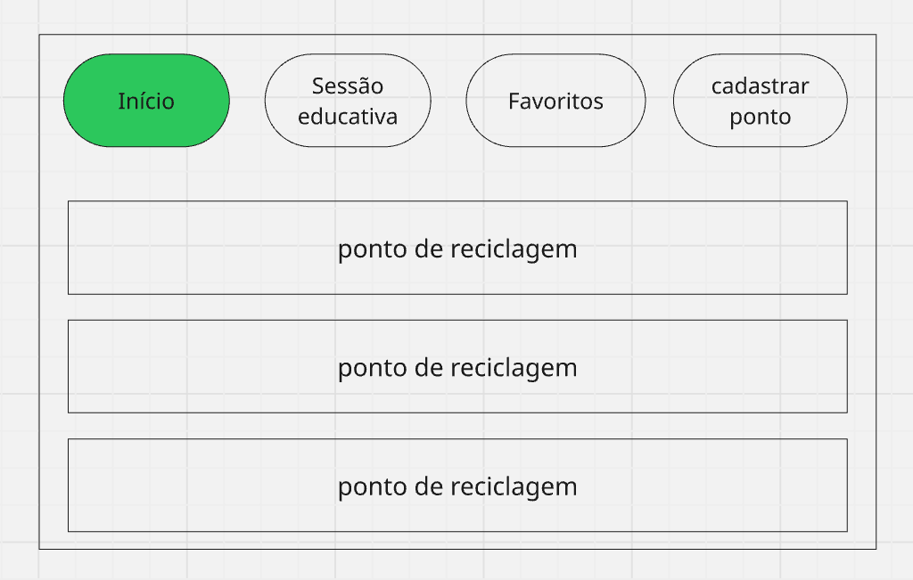
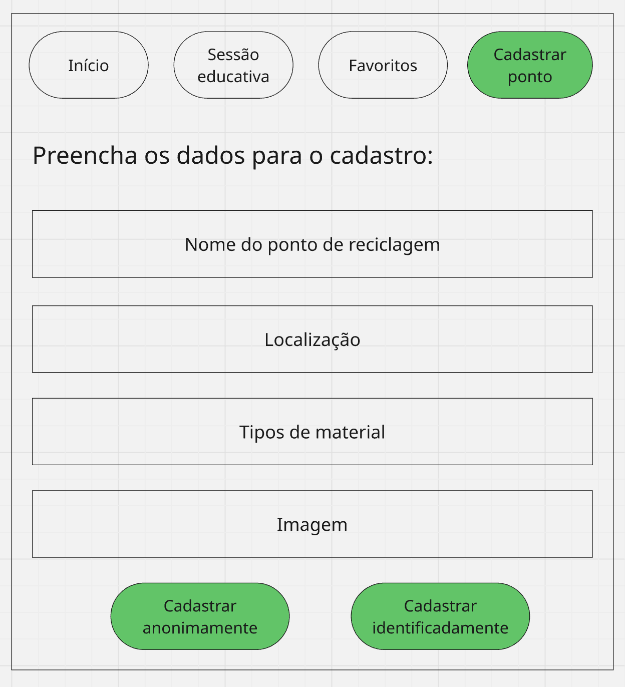
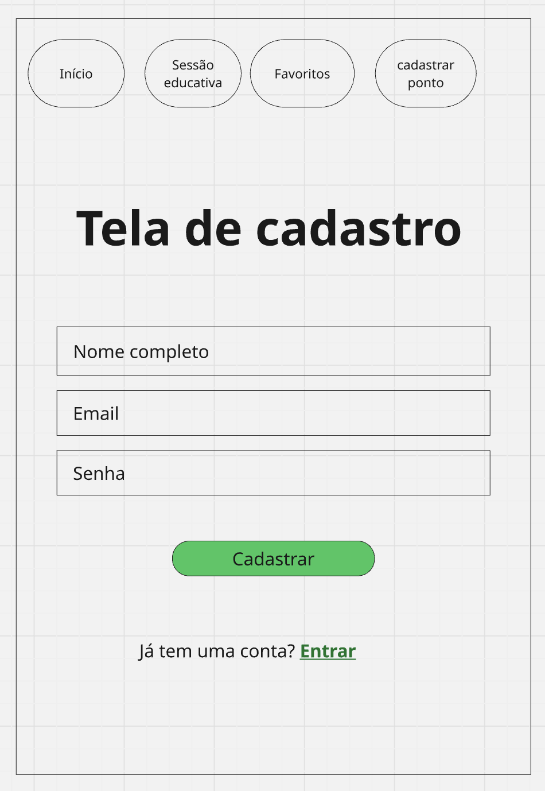
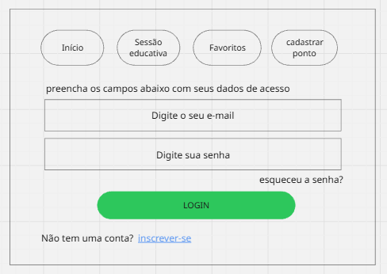
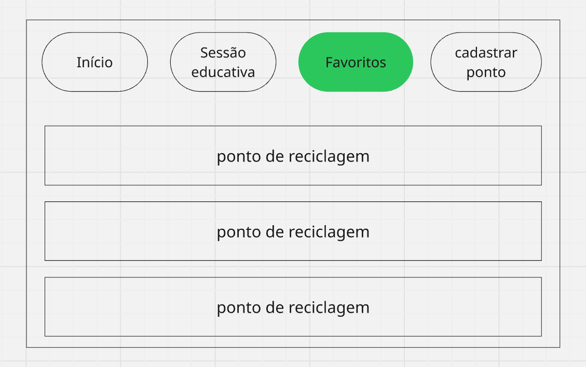
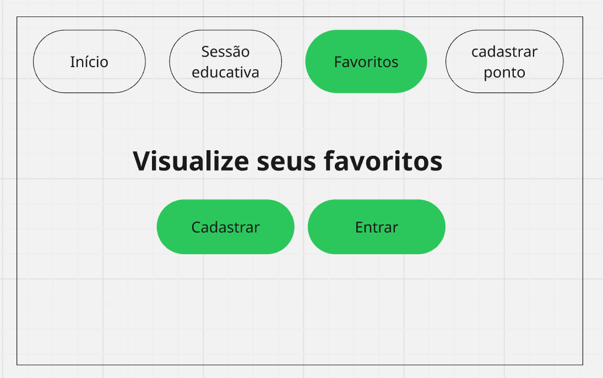
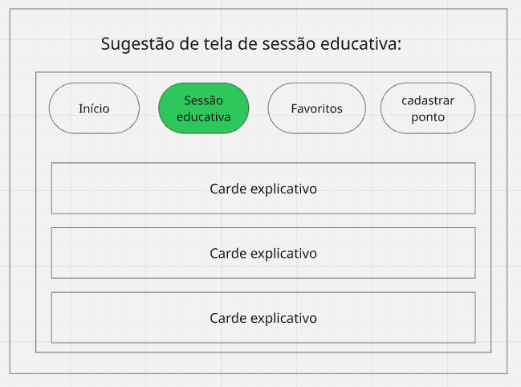

# Projeto de Interface

## User Flow

O fluxograma apresentado na figura abaixo representa o fluxo de interação do usuário pelas telas do sistema. Cada uma das telas deste fluxo é representada na seção de Protótipo de baixa fidelidade.

## Protótipo

Desenvolver um protótipo emerge como uma das maneiras mais ágeis e econômicas de validar uma ideia, conceito ou funcionalidade. Isso permite a interação, avaliação, modificação e aprovação das principais características de uma interface antes de entrar na fase de desenvolvimento. Leia o artigo [Protótipos: baixa, média ou alta fidelidade?](https://medium.com/ladies-that-ux-br/prot%C3%B3tipos-baixa-m%C3%A9dia-ou-alta-fidelidade-71d897559135).

## Protótipo de baixa fidelidade

### Tela - Home (Tela Inicial)

### Tela - Cadastro de Ponto de reciclagem

### Tela - Cadastro de usuário

### Tela - Login

### Tela - Favoritos com login

### Tela - Favoritos sem login

### Tela - Sessão educativa

